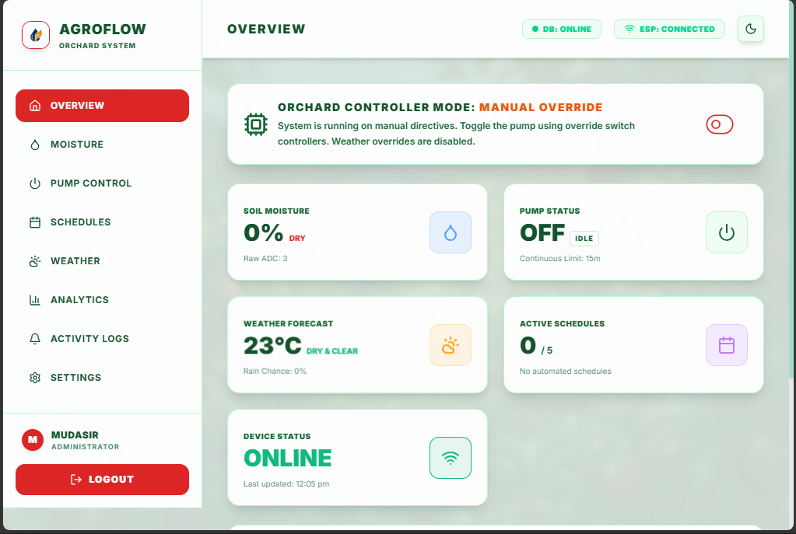
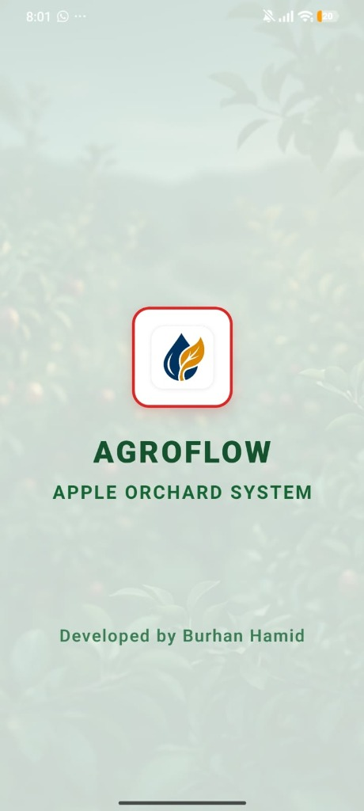
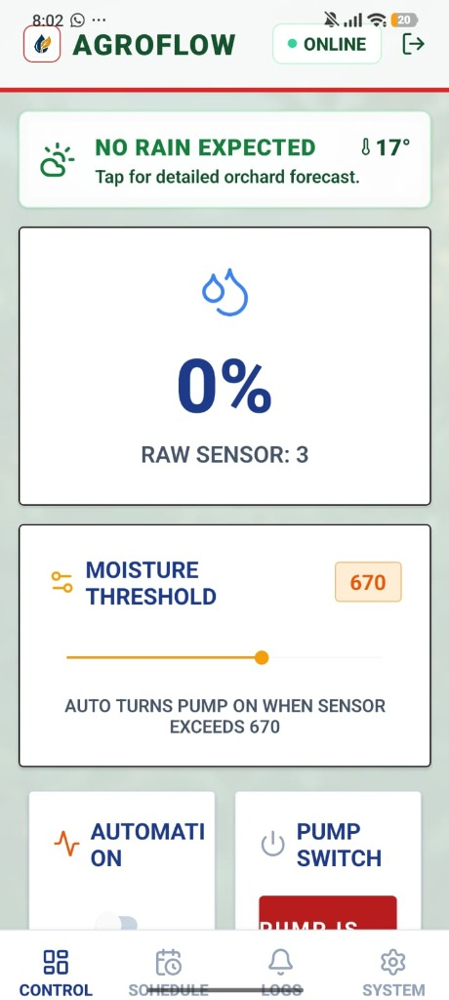
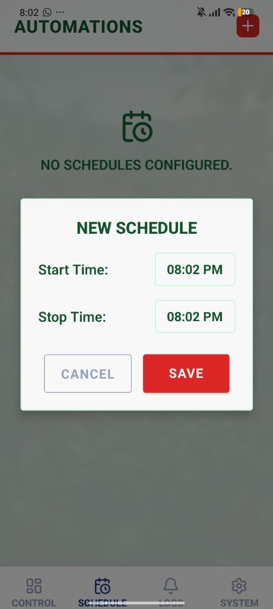
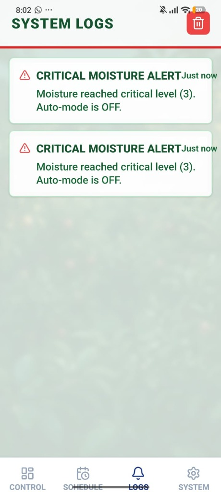
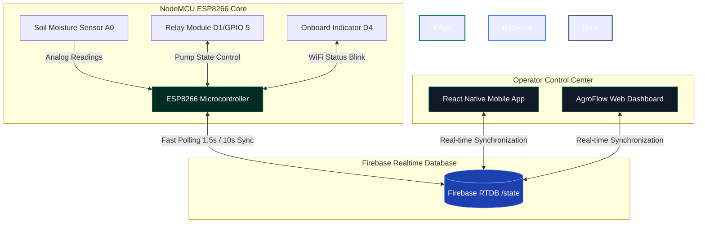

# AgroFlow 🍏💧 (Smart Drip Irrigation & IoT Agricultural Automation System)

[](LICENSE)
[](https://vitejs.dev/)
[](https://react.dev/)
[](https://reactnative.dev/)
[](https://firebase.google.com/)
[](https://www.espressif.com/)

**AgroFlow** is a complete, production-ready, three-tier smart drip irrigation and agricultural automation system engineered specifically for the high-density **Apple Orchards of Kashmir**. 

The system leverages real-time soil telemetry, meteorological forecasts, physical automation safeguards, and a highly responsive dual-client interface (mobile app & web dashboard) to ensure optimal orchard health, conserve water, and provide fail-safe motor protections.

---

## 📸 Interface Showcases

### 🖥️ Web Dashboard Overview


### 📱 Mobile Application Client
| 📱 Splash Screen | 📱 Control Terminal | 📱 Schedule Configurator | 📱 Real-time System Logs |
| :---: | :---: | :---: | :---: |
|  |  |  |  |

---

## 📐 System Architecture

The ecosystem consists of three main sub-projects linked via a real-time database backbone:

1. **Edge Firmware (`/firmware`)**: C++ NodeMCU ESP8266 controller that polls analog soil moisture sensors, executes local stateless schedules, drives physical 5V relays, tracks operational runtimes, and enforces active motor protection guards.
2. **Mobile App (`/app`)**: Sleek, React Native (Expo) app utilizing forest green translucent glassmorphism aesthetics, live sensor telemetry feeds, calendar scheduling, manual control sliders, and coordinate-specific local weather forecasting.
3. **Web Dashboard (`/dashboard`)**: Premium React, TypeScript, and Tailwind CSS v4 multi-page desktop and mobile web client. Seamlessly translates real-time Firebase state updates into radial dynamic gauges, historical runtime charts, interactive dashboards, dynamic theme switches, and push notifications.



---

## 📂 Repository Directory Structure

```plaintext
├── app/                        # Expo React Native Mobile Client
│   ├── src/                    # Source files (screens, configuration, custom hooks)
│   │   ├── config/firebase.js  # Mobile Firebase configurations
│   │   └── ...
│   ├── assets/                 # App assets (logos, background images)
│   └── package.json
│
├── dashboard/                  # React + TS + Tailwind v4 Web Dashboard Client
│   ├── src/                    # Source files (pages, components, styles)
│   │   ├── config/firebase.ts  # Web Firebase client settings
│   │   ├── hooks/                  # Firebase realtime database sync hooks
│   │   ├── pages/                  # 8 Dedicated SPA module views
│   │   └── index.css           # Tailwind v4 directives & forest theme color tokens
│   ├── public/                 # Static brand assets
│   ├── vercel.json             # Vercel deployment routes and SPA rewrites
│   ├── vite.config.ts          # Vite build system definitions
│   └── package.json
│
├── firmware/                   # C++ IoT Controller Source Code
│   └── SmartIrrigation.ino    # Main firmware, NTP sync, relay drivers, & failsafes
│
├── LICENSE                     # Project license file (MIT License)
└── README.md                   # Project documentation hub
```

---

## ⚡ Key Features

### 💻 Web Dashboard
* **Dynamic Theme Switcher**: Instantly toggle between Light and Dark modes. Visual styles are harmonized to match the forest green (`#022c22`) and apple red (`#ef4444`) color tones of the mobile application. Preferences are persistently stored in `localStorage`.
* **8 Dedicated Page Modules**:
  1. **Overview**: Live status command center with motor toggles, operating mode switches, connection states, and critical notification logs.
  2. **Moisture**: Interactive radial SVG moisture gauge, threshold controller slider, and responsive line graphs.
  3. **Pump Control**: Big power control button, visual live countdown timer, and motor protection banners.
  4. **Schedules**: Manage up to 5 individual irrigation schedules. Complete with duration calculation cards and active upcoming indicators.
  5. **Weather**: Real-time forecasts from Open-Meteo including rainfall probabilities, WMO outlook summaries, and ambient temperature/wind metrics.
  6. **Analytics**: Recharts graphs rendering actual daily pump operational durations, aggregate weekly cycle counts, and real-time session telemetry queues.
  7. **Activity Logs**: Color-coded, searchable system log listing critical system transitions, warnings, and protection triggers (limited to the last 50 events, supports log clearing).
  8. **Settings**: Coordinate modification center, browser-GPS geolocator synchronization, and operator profile access controls.
* **HTML5 Push Notifications**: Pings desktop and mobile browsers on key events (e.g., motor overrides, protection trips, moisture drops).
* **Automatic Recovery**: Handles dynamic session reloading, token caching, and robust database re-syncs.

### 📱 Mobile Application
* **Forest-Glassmorphism UI**: Beautiful iOS and Android layouts utilizing translucent panels, customized icons, and apple-orchard backdrop assets.
* **Real-time Synchronization**: Powered by Firebase RTDB, receiving instant telemetry changes with sub-second latency.
* **Schedule Builder**: Interactive timeline scheduler with automatic overnight cross-day support.
* **Smart Overrides**: Automatically suspends schedules or auto-mode cycles if local meteorological forecasts predict rain in the coordinate parameters.

### 🔌 IoT Firmware (ESP8266 Edge Core)
* **1.5s Polling Duty Cycle**: Rapid-response RTDB sync fetches instructions and updates sensor statuses at 1.5-second polling thresholds.
* **Stateless Schedule Engine**: Executes calendar actions entirely on-chip, synchronizing with NTP pool time servers for precise local operations.
* **Motor Failsafe (Pump Protection)**: Shuts off the physical relay automatically if the pump runs continuously past the configured `maxRuntimeMinutes` (default: 20 mins) to prevent dry-running motor burnout.
* **Active Reconnect Shield**: Automatically disables active motor coils and enters search mode to restore connection if WiFi access is interrupted.

---

## ⚙️ Hardware Wiring & Pins Configuration

The firmware is designed for a NodeMCU 1.0 (ESP-12E Module) board:

| Physical Component | Microcontroller Pin | Pin Mode / Description |
| :--- | :--- | :--- |
| **Relay Module (Signal)** | **D1 (GPIO 5)** | OUTPUT (Active HIGH) — Controls the physical drip irrigation pump. |
| **Moisture Sensor (Analog Out)** | **A0 (Analog)** | INPUT — Polls soil moisture values (0 = Bone Dry, 1024 = Fully Saturated). |
| **Onboard Blue LED** | **D4 (GPIO 2)** | OUTPUT (Active LOW) — Blinks rapidly when searching for WiFi, solid when active. |

---

## 📊 Firebase Realtime Database Schema

Deploy your Firebase database using the structure documented below. The state updates in real-time under the `/state` node:

```json
{
  "state": {
    "auto": 0,
    "threshold": 600,
    "moisture": 520,
    "relay": 0,
    "pumpStartTimeEpoch": 0,
    "maxRuntimeMinutes": 20,
    "pumpProtection": {
      "triggered": false,
      "reason": "Maximum runtime exceeded"
    },
    "weather": {
      "rainPredicted": false
    },
    "schedules": [
      {
        "startHour": 6,
        "startMinute": 30,
        "stopHour": 7,
        "stopMinute": 0,
        "enabled": true
      }
    ]
  },
  "credentials": {
    "username": "mudasir",
    "password": "mudasir@123"
  }
}
```

*Note: The web client and mobile clients will automatically seed default values into `/state` and `/credentials` nodes on their first successful connection if the database is initially empty.*

---

## 🔧 Installation & Setup Guides

### Part 1: IoT Firmware Setup (ESP8266 NodeMCU)
1. Install [Arduino IDE](https://www.arduino.cc/en/software).
2. Go to **Preferences** -> Add the following URL to **Additional Boards Manager URLs**:
   `http://arduino.esp8266.com/stable/package_esp8266com_index.json`
3. Install **ESP8266 Board Library** via the Board Manager (version 3.0+ recommended).
4. Install the following libraries via the Library Manager:
   * **Firebase Arduino Client Library for ESP8266 and ESP32** (by Mobizt)
   * **NTPClient** (by Tarauh)
   * **ArduinoJson** (by Benoit Blanchon)
5. Open `firmware/SmartIrrigation.ino` inside Arduino IDE.
6. Configure your parameters in the code:
   ```cpp
   #define WIFI_SSID "YOUR_SSID"
   #define WIFI_PASSWORD "YOUR_PASSWORD"
   #define API_KEY "YOUR_FIREBASE_WEB_API_KEY"
   #define DATABASE_URL "YOUR_FIREBASE_DB_URL"
   #define DATABASE_SECRET "YOUR_FIREBASE_DATABASE_SECRET"
   ```
7. Connect your ESP8266 via USB, select the correct Port and **NodeMCU 1.0 (ESP-12E Module)** board, and click **Upload**.

### Part 2: Mobile App Setup (React Native Expo)
1. Install [Node.js](https://nodejs.org/) (v18.x or v20.x).
2. Navigate to the `app/` folder:
   ```bash
   cd app
   ```
3. Install dependencies:
   ```bash
   npm install
   ```
4. Verify your Firebase configuration parameters match inside `app/src/config/firebase.js`.
5. Launch the Expo bundler:
   ```bash
   npx expo start
   ```
6. Download **Expo Go** on your smartphone (iOS/Android) and scan the displayed QR code.

### Part 3: Web Dashboard Setup (React + TS + Tailwind v4)
1. Navigate to the `dashboard/` folder:
   ```bash
   cd dashboard
   ```
2. Install production and development dependencies:
   ```bash
   npm install
   ```
3. Verify your web-client configuration matches your Firebase console credentials in `dashboard/src/config/firebase.ts`.
4. Launch the local development Vite server:
   ```bash
   npm run dev
   ```
5. Open your browser to `http://localhost:5173`.
6. Compile the optimized, static single-page application (SPA):
   ```bash
   npm run build
   ```

---

## 🚀 Web Dashboard Production Deployment

The Vite web client includes a built-in static router rewrite manifest (`vercel.json`) allowing immediate, painless hosting on **Vercel** with full client-side SPA routing:

1. Install the Vercel CLI globally:
   ```bash
   npm install -g vercel
   ```
2. Run the connection wizard inside the `/dashboard` folder:
   ```bash
   vercel
   ```
3. Link the folder, set the output folder to `dist`, and launch the production deploy:
   ```bash
   vercel --prod
   ```

---

## 🔐 Security & Database Access Control

To restrict database access during production environments, apply the following **Firebase Realtime Database Rules** via the Firebase Console:

```json
{
  "rules": {
    ".read": "auth != null",
    ".write": "auth != null"
  }
}
```

*Note: For testing purposes during hardware/software staging, you can set `.read` and `.write` to `true` to verify fast telemetry connections before reinforcing authentication tokens.*

---

## 👤 Credits & Authorship

* **Developed by**: Burhan Hamid


This system is licensed under the [MIT License](LICENSE). Feel free to adapt and expand this smart automation suite for your own agricultural or residential smart watering systems!
